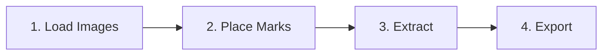

# 

  <strong>A standalone desktop application for easy texture extraction & deskewing from images.</strong>

  

---

## 📖 Overview

**Textract** allows you to load images, mark sections to extract (such as signage, product labels, or building), apply a perspective warp and pack the flattened output into custom texture atlas or export them individually.

  

> [Watch the trailer here!](https://youtu.be/Pa0r_seJ-CE)

---

## ⚡ Key Features

- **Dual-Pane Interactive Workspace**:
    - **Mark Canvas (Left)**: Load source images and mark sections to extract.
    - **Atlas Canvas (Right)**: Arrange extracted textures into an atlas or to export individually.
- **Perspective Correction**: - Extremely fast using **imageproc** and **rayon** for parallelism.
- **Grid Snapping** - With custom grid sizes.
- **Atlas Export**: Arrange your textures into a single atlas for export.
- **Individual Export**: Export textures individually.
- **Auto Updater**: Simple one-click updater to get the latest features and fixes.

---

## 🚀 How It Works

It's this simple:

1. **Load Images**: Load PNG, JPG, JPEG, or BMP files.
2. **Place Marks**: Hold `Ctrl` and click four points to form a rect around your target texture.
3. **Extract**: Hit `Shift + R` or click the Convert button.
4. **Export**: Position the extracted textures on the Atlas Canvas and export!

---

## 🎹 Keyboard Shortcuts & Controls

Textract is designed for speed. Below is a cheat sheet of shortcuts:

### General & Navigation

| Action           | Key / Gesture                               | Description                                         |
| :--------------- | :------------------------------------------ | :-------------------------------------------------- |
| **Pan Canvas**   | `Scroll wheel click + Drag` or `Drag Stage` | Move around the workspace stage                     |
| **Zoom Stage**   | `Scroll Wheel`                              | Zoom in or out on the canvas                        |
| **Context Menu** | `Right Click`                               | Open contextual options (convert, export, settings) |
| **Select All**   | `Ctrl + A`                                  | Select all images                                   |
| **Delete Image** | `Delete` (with image selected)              | Remove image from the canvas                        |

### Mark Canvas (Left Panel)

| Action                    | Key / Shortcut                 | Description                                         |
| :------------------------ | :----------------------------- | :-------------------------------------------------- |
| **Load Images**           | `Shift + A`                    | Open file dialog to load images                     |
| **Add Mark Point**        | `Ctrl + Left Click` (on image) | Place a quad corner (places 4 total)                |
| **Reset Point Selection** | `Right Click` (while marking)  | Clear current unsaved points                        |
| **Process/Convert**       | `Shift + R`                    | Compute perspective warp and extract marks to Atlas |
| **Remove Mark**           | `Alt + Left Click` (on mark)   | Delete the quad mark                                |

### Atlas Canvas (Right Panel)

| Action              | Key / Shortcut | Description                              |
| :------------------ | :------------- | :--------------------------------------- |
| **Export Atlas**    | `Ctrl + E`     | Save current packed sheet as a PNG       |
| **Export Selected** | `Ctrl + S`     | Save selected patches as individual PNGs |

---

## 🛠️ Architecture & Tech Stack

- **Frontend Application**:
    - [React 19](https://react.dev) & [TypeScript](https://www.typescriptlang.org)
    - [react-konva](https://github.com/konvajs/react-konva) / [Konva](https://konvajs.org)
    - [Tailwind CSS](https://tailwindcss.com)
    - [Zustand](https://github.com/pmndrs/zustand)

- **Core**:
    - [Tauri v2](https://tauri.app) (Secure, fast desktop framework)
    - **Rust Backend**:
        - `imageproc` (Warping, bilinear interpolation, geometric transformations)
        - `rayon` (Data parallelism for multi-threaded mark processing)
        - `base64` (Base64 encoding/decoding for inter-process communication)
    - [Github Actions](https://github.com/features/actions)
