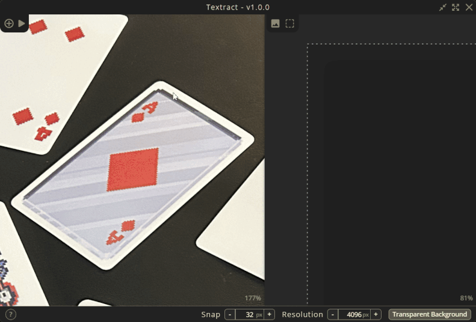
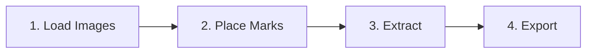

  <strong>A standalone desktop application for easy texture extraction & deskewing from images.</strong>

    
    

## Overview

**Textract** allows you to load images, mark sections to extract (such as signage, product labels, or building), apply a perspective warp and pack the flattened output into custom texture atlas or export them individually.

  

## Key Features

- **Dual-Pane Interactive Workspace**:
    - **Mark Canvas (Left)**: Load source images and mark sections to extract.
    - **Atlas Canvas (Right)**: Arrange extracted textures into an atlas or to export individually.
- **Perspective Correction**: - Extremely fast using **imageproc** and **rayon** for parallelism.
- **Grid Snapping** - With custom grid sizes.
- **Atlas Export**: Arrange your textures into a single atlas for export.
- **Individual Export**: Export textures individually.
- **Auto Updater**: Simple one-click updater to get the latest features and fixes.

## How It Works

1. **Load Images**: Load PNG, JPG, JPEG, or BMP files.
2. **Place Marks**: Hold `Cmd` on macOS or `Ctrl` on Windows/Linux and click four points to form a rect around your target texture.
3. **Extract**: Hit `Shift + R` or click the Convert button.
4. **Export**: Position the extracted textures on the Atlas Canvas and export!

## 📚 Documentation

See [`docs/help.md`](docs/help.md).

The documentation is also available in-app via the 📕 icon in the bottom-left corner.

## Issues

I cannot run the .app in MacOS

The .app is not signed. You must manually remove the quarantine attribute so it can be properly executed.

In the terminal, run:

`xattr -c "PATH_TO_TEXTRACT.APP"`

## 🛠️ Stack

- **Frontend**:
    - [React 19](https://react.dev) & [TypeScript](https://www.typescriptlang.org)
    - [react-konva](https://github.com/konvajs/react-konva) / [Konva](https://konvajs.org)
    - [Tailwind CSS](https://tailwindcss.com)
    - [Zustand](https://github.com/pmndrs/zustand)

- **Backend & Core**:
    - [Tauri v2](https://tauri.app) (Secure, fast desktop framework)
    - **Rust Backend**:
        - `imageproc` (Warping, bilinear interpolation, geometric transformations)
        - `rayon` (Data parallelism for multi-threaded mark processing)
        - `base64` (Base64 encoding/decoding for inter-process communication)
    - [Github Actions](https://github.com/features/actions)
